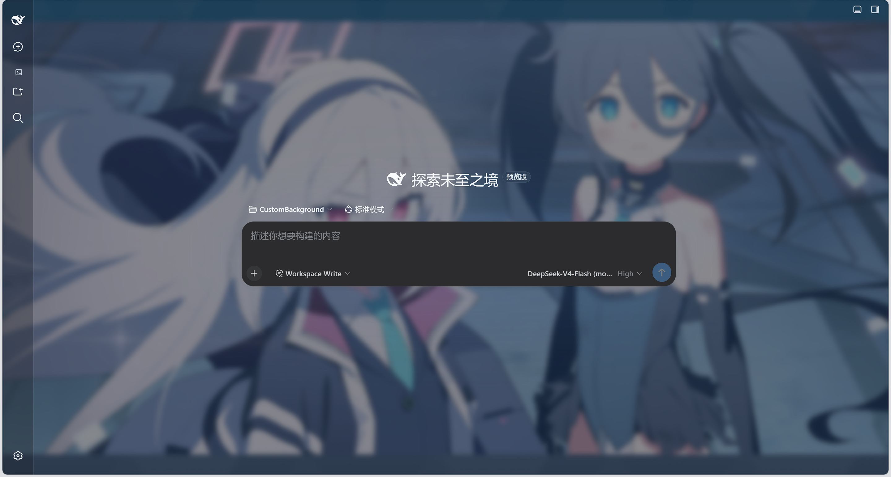

# dsh-background

vibe coding初作品，自定义 DeepSeek Harness（DSH）WebUI 背景插件。在设置侧边栏「agent 预设」下方提供「背景」页面，全部调整实时生效，刷新 / 重启后保持。

## 功能

- **图库背景**：指定本地文件夹，自动扫描其中的图片（png/jpg/webp/gif/bmp/avif/svg），支持缩略图点选与「随机一张」。
- **自由拉伸裁切框**：预览图上拖拽 4 角 / 4 边自由拉伸、框内平移，实时预览背景。
- **效果调节**：水平/垂直缩放、位置、背景不透明度、面板透明度、高斯模糊。
- **显示模式**：cover（铺满裁剪）/ contain（完整显示）/ fill（拉伸填充）。
- **多图交叉淡化轮播**：切换时双图层交叉淡化过渡，可选按图库顺序定时切换，
- **实时生效**：所有调整即时刷新背景；配置持久化在 settings.yaml 的 `background` 命名空间，重启不丢。  




## 快速开始

### 系统要求

- 已安装 DeepSeek Harness，`dsh web` 可正常启动。
- npm 安装方式无额外要求；从仓库安装需要 Node.js >= 22 与 pnpm。

### 三步上手

1. 安装：`dsh plugin --profile web add @starryhui/dsh-background@latest`
2. 重启 `dsh web`
3. 打开「设置 → 背景」配置图库与效果

### 从 npm 安装（推荐）

插件已发布到 npm（`@starryhui` scope），一条命令安装：

```sh
dsh plugin --profile web add @starryhui/dsh-background@latest
```

装完重启 `dsh web`，设置侧边栏「agent 预设」下方出现「背景」入口。

> **装到了旧版本？** pnpm 11+ 默认的发布年龄门禁（`minimumReleaseAge`，内置 24 小时）会把新发布的版本静默隔离。解决办法：在 profile 的 `pnpm-workspace.yaml` 设置 `minimumReleaseAge: 0`（或把 `@starryhui/*` 加进 `minimumReleaseAgeExclude`），再执行 `dsh plugin --profile web update @starryhui/dsh-background@latest`。

### 从 GitHub 仓库安装（开发调试）

```sh
# 1. 克隆仓库
git clone https://github.com/StarryHui/dsh-custom-background.git
cd dsh-custom-background

# 2. 安装到 web profile（lib/ 已随仓库提交，无需本地构建）
dsh plugin --profile web add link:$(pwd)

# 3. 重启 dsh web，设置 → 背景 即可配置
dsh web
```

> 仓库安装仅供开发调试：改 `src/` 后需在 DSH 源码 checkout（packages/client）中重新构建
> （`tsc -b` + `tsdown --env.DSH_BUILD_FACE client`）并把新 `lib/` 复制回本仓库。

## 说明

- 配置命名空间 `background` 通过插件自建同源路由（/dsh-bg/state、/dsh-bg/save、/dsh-bg/css）读写，不依赖官方 settings RPC 的命名空间白名单。
- `src/` 为源码；`lib/` 为构建产物（随仓库提交，便于免构建安装）。

## 许可证

MIT
